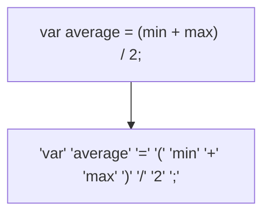

# Building a Lox interpreter in Haskell

## Prereqs

### Bootstrapping & Self-hosting

Say you create a programming language "Aerolang" and need a way to compile it. Naturally, you decide to write a compiler in Aerolang itself (inserts ouroboros reference). But how would you compile a the compiler you wrote in the very language it's supposed to compile?

One way of doing so is by writing another compiler for Aerolang in a different language, such as C, let's call this `CAero`. We compile the CAero with GCC (or Clang) and use the resulting executable to compiler the compiler written in Aerolang, this process is known as **bootstrapping**.

Once we have a working compiler written in Aerolang, can use it to compile our Aerolang source code main.aero. A compiler capable of compiling the same language it was written in is said to be self-hosting.

### Parts of a Language

#### Lexical Analysis

This phase also known as scanning/lexing is where a **scanner/lexer** takes a stream of characters, chunks them teogether and breaks them into **tokens**. Some tokens are single characters like operators (+, -, /, *, %) and brackets, while others may be several characters long like numbers (325), string literals ("hello"), and identifiers (max).



Characters like whitespaces and comments are often ignored by the lexer as they're insignificant.

#### Parsing (terminology alert!)

> [!NOTE]
> A **syntax** is a collection of rules that determine what programs are valid. A **grammar** is a formal specification of a syntax.
>
>  ```
>  SYNTAX: "You can add expressions together"
>  GRAMMAR: E -> T (("+" | "-") T)*
>  ```

The parsing stage is where a **parser** takes a sequence of tokens and uses a grammar to determine whether the sequence is valid (eg. match for an
expression or statement). If it is, the parser builds a **parse tree/abstract syntax tree (AST)**, otherwise it generates a **syntax error**.

```bash
        Stmt.Var                [average]
                                    ⇓
        Expr.Binary                [/]
                                  ⇙  ⇘
        Expr.Binary             [+]   [2]            Expr.Literal
                              ⇙  ⇘
        Expr.Variable        [min] [max]             Expr.Variable
```

#### Semantic Analysis

At this point we know that `a + b` is an expression and that we're adding `a` and `b`. But we don't know what those names refer to, what their *types* are, if they're *local* or *global* or where they're defined.

  The parser understands the structure but not the meaning.

In the semantic/static analysis phase, the **semantic analyzer** "walks" the AST, and for each identifier (eg. a) tries to determine where it's declared. This process is known as **name resolution/binding** and is where scope comes into play.

  - In **statically typed** languages, this phase is also where type checking is
    performed by the compiler at compile time (before the program runs). Once
    the semantic analyzer determines where a and b are declared and what their
    types are, the type checker determines whether those types can be added
    together. If not, it reports a type error.

  - In **dynamically typed** languages (eg. Python), type checking is performed at
    runtime (during program execution) by the interpreter. Here the type of a
    variable like x may not be known until the program is executed.

The result (semantic information) of semantic analysis is stored back as extra fields/attributes in the nodes of the AST to produce an annotated AST.

```
    Stmt.Var                    [average : Number]
                                          ⇓
    Expr.Binary                     [/ : Number]
                                      ⇙      ⇘
    Expr.Binary             [+ : Number]   [2 : Number]      Expr.Literal
                              ⇙     ⇘
    Expr.Variable   [min : Number] [max : Number]            Expr.Variable
```

Other times, we might want to store the information into a lookup table called a **symbol table**. The key of the symbol table will be the identifiers (min, max, average), and the values associated with each key will tell us what the identifier refers to.

We can also transform the AST into a whole other data structure called the **Intermediate Representation (IR)** that more directly expresses the semantics of the code. Compilers like GCC and LLVM do this.

> [!NOTE] 
> At this stage, the values of a and b aren't substituted yet. Just their types. Instead, semantic information such as their declarations, scope
information, and types,is attached to the AST or stored in symbol tables.

Everything up to this point is considered the **front end**.

#### Intermediate Representation (IR)

IR acts as an Intermediate stage between the front-end (lexing, syntax analysis, semantic analysis), optimization and the back-end (code generator,
machine code).

It's much harder to generate code from an AST directly, so instead we can convert it into IR and one way of doing so is using three-address code.

```
t1 = min + max
t2 = t1 / 2
average = t2
```

This also makes it much easier to optimize and implement a back-end for if we're targeting multiple architectures like x86, ARM, RISC-V, etc.

By having all backends operate on the same IR, we avoid having each architecture-specific backend understand the AST directly, and we can share
optimizations among all targets.

##### Example: Python bytecode

We can see an example of an Intermediate Representation in Python which is often described as an interpreted language, when its execution model actually involves both compilation and interpretation.

What? Yep, when you run your source code, `CPython` (the reference implementation of Python; it contains both a compiler and an interpreter/PVM amongs a lot of other stuff) first compiles it into an intermediate form known as **bytecode**.The bytecode is then executed by the **Python Virtual Machine (PVM)**, which interprets one instruction at a time. Optionally, Python may cache the bytecode onto the disk as `.pyc` files inside `__pycache__`.

This is very similar to Java's execution model. **Java source files** (`.java`) are compiled into **bytecode** (`.class`) which is executed by the **Java Virtual Machine (JVM)**. Modern JVMs use **Just-In-Time (JIT) compilation**, where, frequenntly executed and performance critical code, called **hotspots**, are dynamically recompiled into native machine code for the target architecture. Sophisticated JITs insert **profiling hooks** into the generated code to identify these hotspots and apply more aggressive optimization, such as **constant folding** and **loop unrolling**.

`PyPy` uses a similar strategy for Python programs, using a JIT to improve performance.

```py
print("hello, world")
```

```py
➜  .temp python3 -m dis hello.py
  0           RESUME                   0

  1           LOAD_NAME                0 (print)
              PUSH_NULL
              LOAD_CONST               0 ('hello, world')
              CALL                     1
              POP_TOP
              LOAD_CONST               1 (None)
              RETURN_VALUE
```

#### Optimization

This is fairly self-explanatory. Optimization is where you swap out parts of the program with optimized code while maintaining the same semantics. There are several optimization techniques.

1. **Constant folding**: This is where expressions with known values at compile time can be evaluated and replaced with the computed result. It's also done with **constant propagation** where variables that are known to be constants are substituted with their values before the expression is evaluated.

2. **Loop unrolling**: This is essentially the process of "unwinding" a loop into a sequence of instructions to reduce loop overhead.

```c
for i := 1:8 do
  if i mod 2 = 0 then odd(i)
  else even(i);
  next i;    
```

turns into...

```c
odd(1); even(2);
odd(3); even(4);
odd(5); even(6);
odd(7); even(8);
```

Developers put a lot of effort into optimizing their code. Many successful language implementations, such as Lua and CPython, perform relatively little
compile-time optimization and instead focus much of their performance effort on the runtime.

You can look into more optimization strategies like “common subexpression elimination”, “loop invariant code motion”, “global value numbering”, “strength reduction”, “scalar replacement of aggregates”, “dead code elimination”, etc.

#### Code Generation

Code generation is the final phase of a compiler. In this phase, we convert our optimized intermediate representation into machine code or some lower-level instructions that can eventually be executed by a CPU.

This phase belongs to the back end of the compiler. Here we must decide things such as:

- Which instruction set architecture (ISA) we're targeting (x86-64, ARM, RISC-V, etc.).
- Whether we're generating native machine code or instructions for a virtual machine.

For example, machine code compiled for x86-64 won't run on ARM, and vice versa.

One solution to this portability problem was to generate instructions for a virtual machine instead of a physical CPU. Historically, these instructions were called p-code (portable code). Today, we usually call them bytecode.

```asm
(gdb) disassemble main
Dump of assembler code for function main:
   0x0000000000400466 <+0>:     push   rbp
   0x0000000000400467 <+1>:     mov    rbp,rsp
   0x000000000040046a <+4>:     mov    edi,0x401180
   0x000000000040046f <+9>:     mov    eax,0x0
   0x0000000000400474 <+14>:    call   0x400370 <printf@plt>
   0x0000000000400479 <+19>:    mov    eax,0x0
   0x000000000040047e <+24>:    pop    rbp
   0x000000000040047f <+25>:    ret
End of assembler dump.
(gdb) x/s 0x401180
0x401180:       "hello, world"
(gdb)
```

<details>

<summary>The Stack</summary>

##### What happens when we execute code?

The code block shown above is a compiled C code which prints "hello, world"

```c
#include <stdio.h>

int main() {
  printf("hello, world");
  return 0;
}
```

When we first run our code, the operating system creates something called a **stack frame** for the `main()` function. This is done in 2 steps,

```asm
push rbp
mov rbp, rsp
```

`push rbp` stores the value of the base pointer in some memory on the newly created stack frame for `main()` and `mov rbp, rsp` makes the base pointer now point to the top of the stack.

```
                                           push rbp                       mov rbp, rsp
        +=========+                       +=========+                     +=========+
0x2000  | old_rbp | <-- rbp               |   ...   |                     |   ...   |
        +=========+                       +=========+                     +=========+
        |   ...   |          ===> 0x2ff0  |   smtn  |        ===> 0x2ff0  |   smtn  |
        +=========+                       +=========+                     +=========+
0x2ff0  |   smtn  | <-- rsp       0x2ff8  |  0x2000 | <-- rsp     0x2ff8  |  0x2000 | <-- rsp, rbp
        +=========+                       +=========+                     +=========+
```

`0x2ff8` is now the start of the new stack from for `main()`.

> [!NOTE]
> The stack grows downwards, contrary to the stack you've learnt in your data structures and algorithms class. Though, it works the same way.


</details>

#### Virtual Machine

If a compiler produces bytecode, it needs a virtual machine (VM) to execute that bytecode because real CPUs only understand machine code.

Another approach is to write a compiler for each target architecture that translates the bytecode into native machine code. In this case, the bytecode acts as an intermediate representation (IR).

Executing bytecode through a VM is generally slower than executing native machine code because the VM must interpret or otherwise process each bytecode instruction at runtime. In exchange, we gain simplicity and portability.

A common approach is to implement the VM in C because C compilers exist for many platforms. By recompiling the VM itself for a different machine, the same bytecode can run unchanged on that machine.

#### Runtime

Once the program is compiled, the last step left is to run it, this step is called the runtime. Essentially, it's everything that exists to support a program while it's executing. For example, a language which automatically manages the memory requires a garbage collector in order to reclaim the unused bits.

In, say, Go, each compiled application has its own copy of Go’s runtime directly embedded in it. If the language is run inside an interpreter or VM, then the runtime lives there. This is how most implementations of languages like Java, Python, and JavaScript work.

## References

- https://en.wikipedia.org/wiki/Loop_unrolling
- https://en.wikipedia.org/wiki/Constant_folding


